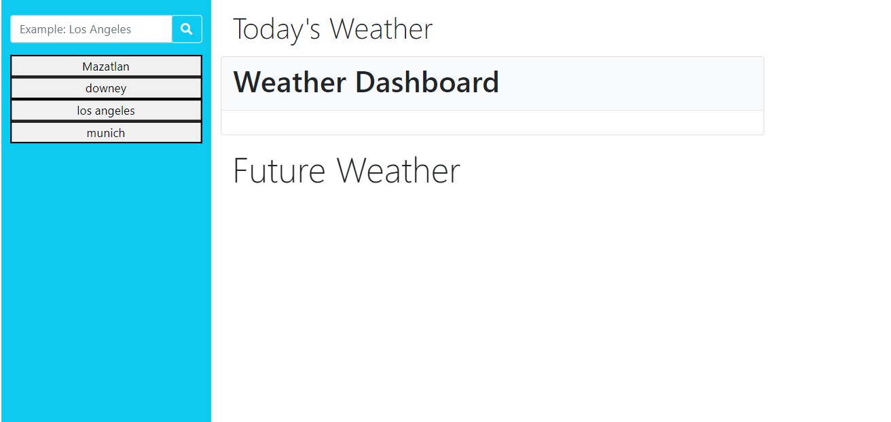
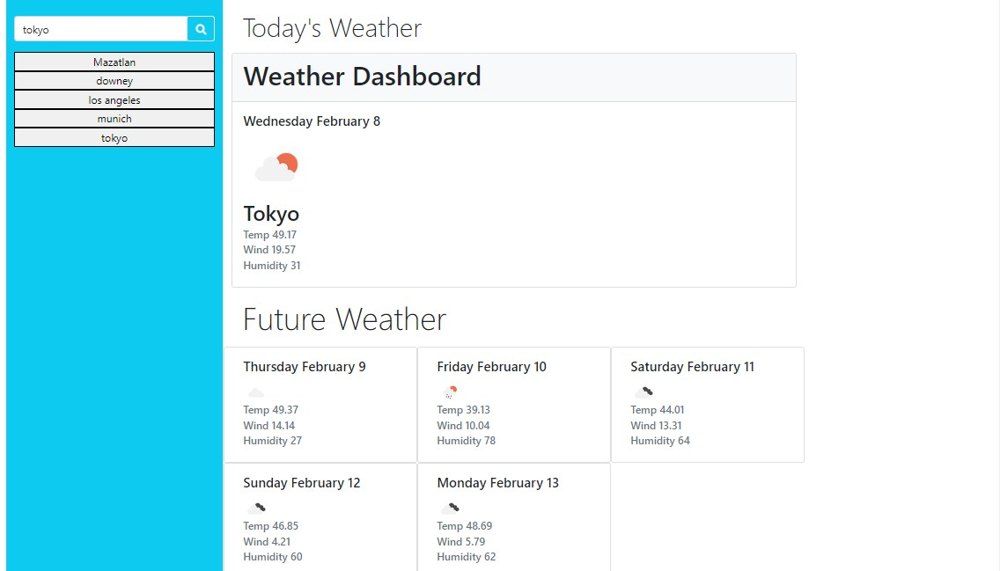
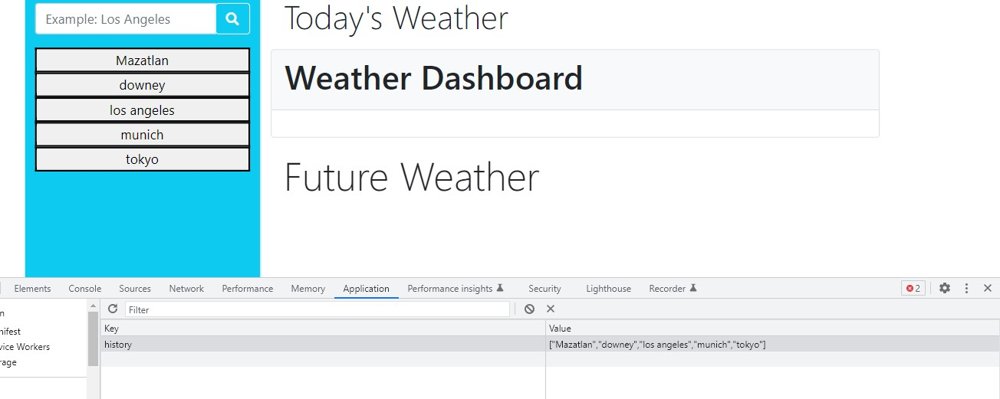

# Is-it-cold-
Weather Forecast

With this app you will be able to search the weather forecast from any part of the globe.
The app is calling an API from https://openweathermap.org/. We are using a 5 Day - 3 hour API forecast.

This weather forecast will display the name of the city, temperature, wind and humidity for the current day and the for the future 5 five days.

When you search a city, the city you searched will be saved in the search history and when you click on any city of the search history it will populate back the current and five future days weather forecast.

The search history will be saved in local storage. If you search a city that you have searched previoulsy, local storage will not duplicate the searched city.

Screenshots

City Weather Forecast

Local Storage

